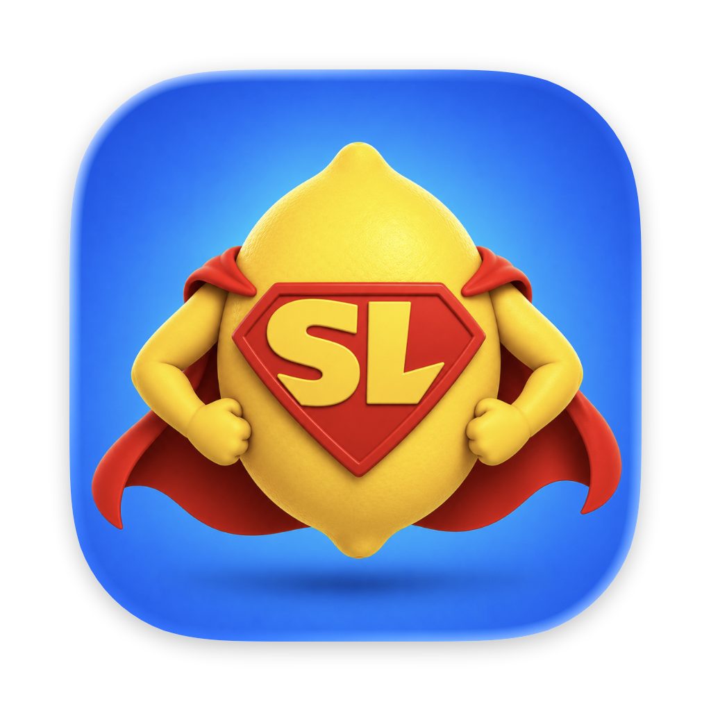
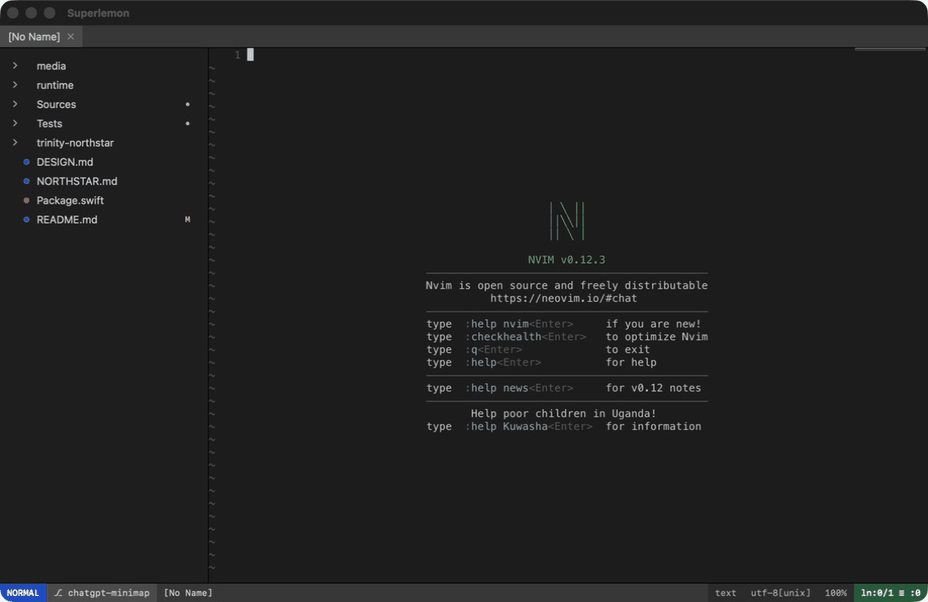

# Superlemon

<p align="center">
  
</p>

Superlemon grew out of a love for Sublime Text's speed and native feel, and for
Neovim's expressive editing model. It brings those ideas together without
adding a Vim-emulation layer: Neovim is the editor. It remains authoritative
for buffers, modes, mappings, plugins, highlighting, undo, and every final grid
frame.

Superlemon is the native macOS application built around that engine. It turns
Neovim state into AppKit windows, pixels, motion, menus, panels, and gestures—
about as far as a native Mac integration can go without forking Neovim itself.
The result includes smooth display-linked scrolling, a native file browser,
Quick Open, a minimap, a buffer tab bar, and a command/status bar integrated
into the main window, plus native key handling and marked-text IME composition.
Active composition retains attributed clauses and local replacement ranges;
arbitrary-buffer reconversion remains outside the current text snapshot model.

This is still Neovim, not merely an editor with a Vim mode. Your mappings and
Neovim plugins continue to work through your configuration, while Superlemon
adds native Mac surfaces where they improve the experience.



## Requirements

- macOS 14+ for the packaged application
- Xcode 16 / Swift 6 only when building from source, including the current
  Homebrew formula

Packaged builds include Neovim, so users do not need to install it separately.
Running the bare executable during development may use
`SUPERLEMON_NVIM` to select an explicit Neovim 0.12+ executable. Packaged
releases use their checksum-verified bundled copy.

## Run

Install the latest release with Homebrew:

```sh
brew tap jagtesh/tap
brew install superlemon
```

Homebrew builds Superlemon from source on your Mac and packages the application
locally, so this route does not need to bypass Gatekeeper. It requires Xcode 16
or newer. Run `superlemon` from a project directory after installation.

Or build and run from source:

```sh
swift build
.build/debug/superlemon
```

Superlemon opens the current directory as its workspace. Press `⌘P` for Quick
Open, `⌘O` to open a file, and `⇧⌘O` to switch folders.

To build a native application bundle with the system-managed macOS icon and
install it to `/Applications`, replacing and relaunching any running copy:

```sh
scripts/publish-local.sh
```

Pass `--dry-run` to build and verify without touching `/Applications`, or run
`scripts/package-app.sh` directly if you only want the bundle at
`dist/Superlemon.app` without installing it.

### Versioning

Superlemon's version is derived from git, not typed in by hand. Every build
reads `scripts/version.sh`, which looks at the latest `vX.Y.Z` tag and how far
HEAD has moved past it:

- At a clean tagged commit, the version is the tag itself, e.g. `0.1.4`.
- Otherwise it's the next patch version plus a dev suffix, e.g.
  `0.1.5-dev.17` (with `.dirty` appended if the working tree has
  uncommitted changes). This is what Superlemon shows for local and CI
  builds.

`scripts/release.sh` needs no argument — it bumps the patch version
automatically. Pass `minor` or `major` to bump those instead, or an explicit
`X.Y.Z` to override.

## Configure

The managed configuration lives in `runtime/config/`. Personal overrides belong
in `~/.config/superlemon/init.vim`; because Neovim remains the editor, this file
can define ordinary options, mappings, autocmds, and plugin configuration. It is
sourced exactly once after the bundled baseline. You can instead choose your
normal Neovim init or one exact custom init from **Superlemon → Settings…**;
those modes do not receive the managed configuration afterward.

Common development overrides are:

| Variable | Purpose |
| --- | --- |
| `SUPERLEMON_NVIM` | Path to the Neovim executable |
| `SUPERLEMON_RUNTIME` | Path to the bundled runtime |
| `SUPERLEMON_LISTEN` | Expose the embedded Neovim socket |

## Test

```sh
swift test
bash runtime/tests/run.sh
```

Every push and pull request tests and produces an arm64, ad-hoc-signed validation
artifact in GitHub Actions. Tagged releases additionally require the protected
Developer ID/notarization environment before publishing a distributable app.
Before approving a tagged build, follow the
[release acceptance runbook](packaging/RELEASE_ACCEPTANCE.md), copy its
[machine-readable record](packaging/RELEASE_ACCEPTANCE.json), run the manual
IME, VoiceOver, memory, filesystem-stress, and sidebar-layout matrix against the
exact validation archive, and retain the completed results and referenced
evidence. The template deliberately starts at `NOT RUN`; a green build or GUI
smoke is not a substitute for those results.

Trusted main/tag builds require an interactive ARM64 self-hosted Mac labeled
`superlemon-gui`. Main uses the `gui-acceptance` environment; tags use the
separate, protected `release-acceptance` environment. A tag cannot
advance to the release job unless that runner gate validates a completed record
against the exact tag, commit, archive filename, and SHA-256, with every required
check and overall decision at `PASS`. Configure the environment variable
`SUPERLEMON_ACCEPTANCE_RECORD_PATH` as the absolute runner-local path to that
record in `release-acceptance` and protect tag deployments with required review.
Main builds only stage
unfinished templates. The GUI job has read-only repository access and receives
no Developer ID or notarization credentials. Keep every Apple credential as an
environment secret scoped only to `release`; do not configure those values as
repository-level, `gui-acceptance`, or `release-acceptance` secrets.

To create a versioned GitHub Release from a clean, up-to-date `main` branch:

```sh
scripts/release.sh
```

With no argument this bumps the patch version automatically (see
[Versioning](#versioning) above); pass `minor`, `major`, or an explicit
`X.Y.Z` to choose a different version. The command records the version,
creates the release commit and tag, and pushes them atomically. GitHub
Actions tests the tagged source, signs the exact tested app with Developer
ID, notarizes and staples it, and attaches the arm64 archive plus SHA-256 to
the corresponding GitHub Release. Once the release workflow completes,
publish its checksum-pinned source formula:

```sh
scripts/publish-homebrew-formula.sh 0.2.0
```

See [DESIGN.md](DESIGN.md) for the implemented architecture,
[NORTHSTAR.md](NORTHSTAR.md) for the product direction, and
[runtime/CONTRACT.md](runtime/CONTRACT.md) for the Swift/Lua interface.

## Contributing

Feedback and discussion are more valuable than unsolicited code. Tell us what
you like, what you do not, and what would make Superlemon better for you by
opening an issue. Please read [CONTRIBUTING.md](CONTRIBUTING.md) before starting
a pull request.

## License

Copyright © 2026 Jagtesh Chadha. Released under the [BSD 3-Clause
License](LICENSE).
