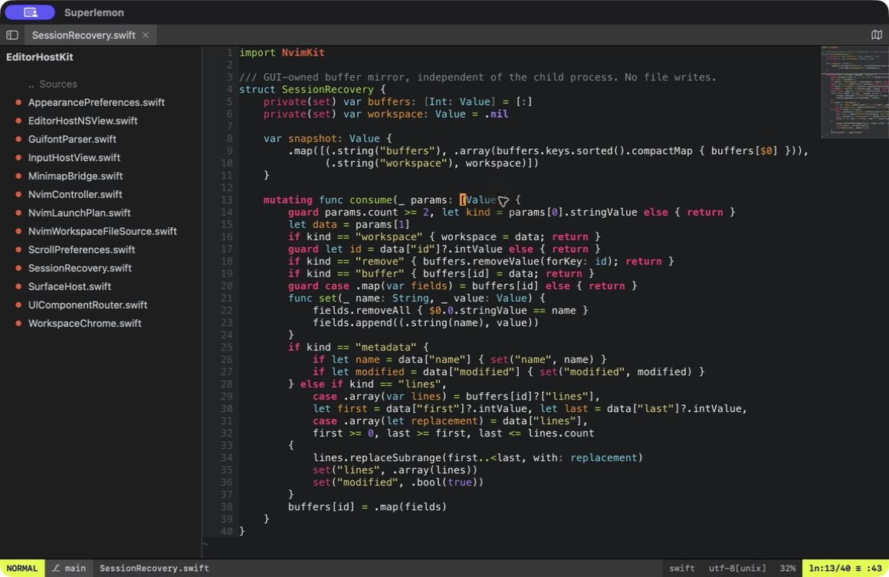

# Superlemon

<p align="center">
  
</p>

Superlemon grew out of a love for Sublime Text's speed and native feel, and for
Neovim's expressive editing model. It brings those ideas together without
adding a Vim-emulation layer: Neovim is the editor. It remains authoritative
for buffers, modes, mappings, plugins, highlighting, undo, and every final grid
frame.

Superlemon is the native macOS application built around that engine. It turns
Neovim state into AppKit windows, pixels, motion, menus, panels, and gestures—
about as far as a native Mac integration can go without forking Neovim itself.
The result includes optional display-linked smooth scrolling, a native file browser,
Quick Open, a minimap, a buffer tab bar, and a command/status bar integrated
into the main window, plus native key handling and marked-text IME composition.
Active composition retains attributed clauses and local replacement ranges;
arbitrary-buffer reconversion remains outside the current text snapshot model.

This is still Neovim, not merely an editor with a Vim mode. Your mappings and
Neovim plugins continue to work through your configuration, while Superlemon
adds native Mac surfaces where they improve the experience.



Smooth scrolling is opt-in through **View → Smooth Scrolling** and defaults to off.

## Requirements

- macOS 14+ for the packaged application
- Xcode 16 / Swift 6 only when building from source, including the current
  Homebrew formula

Packaged builds include Neovim, so users do not need to install it separately.
Running the bare executable during development may use
`SUPERLEMON_NVIM` to select an explicit Neovim 0.11+ executable. Packaged
releases use their checksum-verified bundled copy.

## Crash recovery

If a local Neovim child crashes, Superlemon restarts it automatically and restores
normal text buffers (including unsaved scratch buffers), tabs, splits and cursor
positions from an incremental mirror held by the GUI. Restoration does not write
your files. A second crash within a minute offers manual restart or Safe Start.
The mirror covers notifications received before the crash, survives only while
Superlemon remains running, and does not restore undo history, terminal jobs or
arbitrary plugin state. SSH sessions retain manual reconnect handling; a lost
connection may leave the remote Neovim alive.

## Run

Download the Apple Silicon binary from [GitHub Releases](https://github.com/jagtesh/superlemon/releases/latest),
extract the ZIP, and move `Superlemon.app` into `/Applications`. Release 0.1.5
is ad-hoc signed, **not Developer ID signed or notarized**. macOS may block its
first launch; review the release and use **System Settings → Privacy & Security →
Open Anyway** if you trust the download. A SHA-256 file accompanies the archive.
Intel Macs can build from source; the downloadable binary is arm64 only.

Alternatively, install with Homebrew:

```sh
brew tap jagtesh/tap
brew install superlemon
```

Homebrew builds Superlemon from source on your Mac and packages the application
locally, so this route does not need to bypass Gatekeeper. It requires Xcode 16
or newer. Run `superlemon` from a project directory after installation.

Or build and run from source:

```sh
swift build
.build/debug/superlemon
```

Superlemon opens the current directory as its workspace. Press `⌘P` for Quick
Open, `⌘O` to open a file, and `⇧⌘O` to switch folders.

To build a native application bundle with the system-managed macOS icon and
install it to `/Applications`, replacing and relaunching any running copy:

```sh
scripts/publish-local.sh
```

Pass `--dry-run` to build and verify without touching `/Applications`, or run
`scripts/package-app.sh` directly if you only want the bundle at
`dist/Superlemon.app` without installing it.

### Versioning

Superlemon's version is derived from git, not typed in by hand. Every build
reads `scripts/version.sh`, which looks at the latest `vX.Y.Z` tag and how far
HEAD has moved past it:

- At a clean tagged commit, the version is the tag itself, e.g. `0.1.4`.
- Otherwise it's the next patch version plus a dev suffix, e.g.
  `0.1.5-dev.17` (with `.dirty` appended if the working tree has
  uncommitted changes). This is what Superlemon shows for local and CI
  builds.

`scripts/release.sh` needs no argument — it bumps the patch version
automatically. Pass `minor` or `major` to bump those instead, or an explicit
`X.Y.Z` to override.

## Configure

The managed configuration lives in `runtime/config/`. Personal overrides belong
in `~/.config/superlemon/init.vim`; because Neovim remains the editor, this file
can define ordinary options, mappings, autocmds, and plugin configuration. It is
sourced exactly once after the bundled baseline. You can instead choose your
normal Neovim init or one exact custom init from **Superlemon → Settings…**;
those modes do not receive the managed configuration afterward.

The managed defaults include Molokai syntax colors, Airline-style neon green
status-bar accents, and bundled vim-surround (`cs"'`, `ds"`, `ysiw)` and visual
`S`). Personal overrides can select another `colorscheme` or disable surround
with `let g:loaded_surround = 1` before it loads.
Molokai is a dark palette; choose an adaptive colorscheme such as `default`
in your override if you want editor colors to follow Light/Dark appearance.

Common development overrides are:

| Variable | Purpose |
| --- | --- |
| `SUPERLEMON_NVIM` | Path to the Neovim executable |
| `SUPERLEMON_RUNTIME` | Path to the bundled runtime |
| `SUPERLEMON_LISTEN` | Expose the embedded Neovim socket |

## Test

```sh
swift test
bash runtime/tests/run.sh
```

The GitHub Actions build job runs tests and packages an arm64, ad-hoc-signed
validation artifact. The automated notarized release route additionally requires
the protected Developer ID/notarization environment. It is separate from the
manually published ad-hoc release described above.
Before approving the notarized release route, follow the
[release acceptance runbook](packaging/RELEASE_ACCEPTANCE.md), copy its
[machine-readable record](packaging/RELEASE_ACCEPTANCE.json), run the manual
IME, VoiceOver, memory, filesystem-stress, and sidebar-layout matrix against the
exact validation archive, and retain the completed results and referenced
evidence. The template deliberately starts at `NOT RUN`; a green build or GUI
smoke is not a substitute for those results.

CI uses GitHub-hosted macOS runners for Swift tests, headless Neovim runtime
specs, package verification, and the clean-profile `--smoke` check. No interactive
self-hosted GUI runner is required. GUI acceptance remains a manual check using
the runbook and validator above; CI does not collect or enforce its record.
Before approving a notarized release, review that evidence in the protected
`release` environment. Keep every Apple credential as an environment secret
scoped only to `release`, not as a repository-level secret.

To create and push a versioned tag from a clean, up-to-date `main` branch:

```sh
scripts/release.sh
```

With no argument this bumps the patch version automatically (see
[Versioning](#versioning) above); pass `minor`, `major`, or an explicit
`X.Y.Z` to choose a different version. The command records the version,
creates the release commit and tag, and pushes them atomically. GitHub
Actions attempts the protected pipeline described above; a pushed tag alone
is not a published release. When its acceptance and signing prerequisites are
met, it signs the tested app with Developer ID, notarizes and staples it, and
attaches the archive and SHA-256. For the manual ad-hoc packaging procedure, see
[the release guide](packaging/RELEASING.md). Once the release is published,
publish its checksum-pinned source formula:

```sh
scripts/publish-homebrew-formula.sh 0.1.5
```

See [DESIGN.md](DESIGN.md) for the implemented architecture,
[NORTHSTAR.md](NORTHSTAR.md) for the product direction, and
[runtime/CONTRACT.md](runtime/CONTRACT.md) for the Swift/Lua interface.

## Contributing

Feedback and discussion are more valuable than unsolicited code. Tell us what
you like, what you do not, and what would make Superlemon better for you by
opening an issue. Please read [CONTRIBUTING.md](CONTRIBUTING.md) before starting
a pull request.

## License

Copyright © 2026 Jagtesh Chadha. Released under the [BSD 3-Clause
License](LICENSE).
